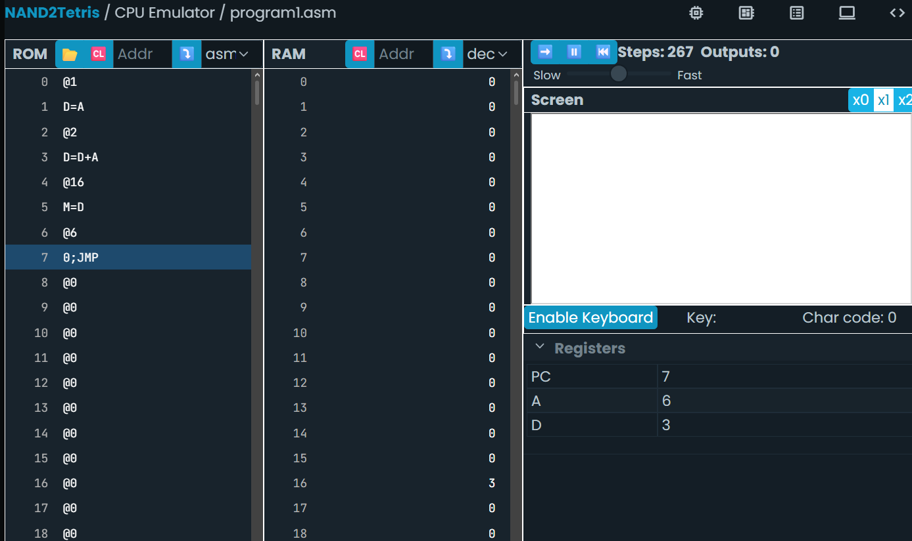
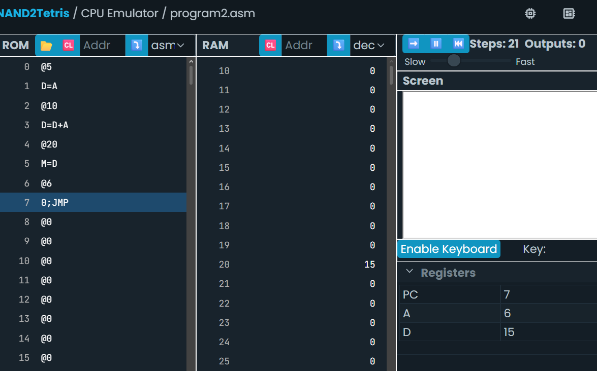

## Sesión 2. Modelo Hack y ciclo fetch-decode-execute

### Actividad 2: Ciclo fetch-decode-execute

```

## **Experimento**

Ahora es tu turno. Crea un archivo llamado `program.asm` y copia el código del programa anterior. Ejecuta el programa en el simulador de la CPU Hack y observa cómo se comporta. ¿Qué sucede? ¿Qué valor se almacena en la dirección de memoria 16? ¿Por qué crees que es ese valor? ¿Qué instrucciones se ejecutan en cada ciclo Fetch-Decode-Execute? ¿Qué cambios observas en el contenido de la memoria y los registros? ¿Qué instrucciones se ejecutan en cada ciclo Fetch-Decode-Execute?
```


> El programa apunta a la dirección de 1 y almacena la dirección como valor en D, luego apunta a la dirección 2 y en D se almacena el valor que ya tenía guardado sumado a la dirección a la que apunta, es decir 1+2=3, ahora apunta a la dirección 16 y en la RAM de esa dirección guarda el valor de 16, con lo cual 16 en RAM tiene como valor 3, va a la etiqueta para lockear un bucle, efectivamente terminando el proceso.
 

## **Experimento**

Escribe un programa en lenguaje ensablador que sume los números 5 y 10, y almacene el resultado en la dirección de memoria 20. Utiliza el simulador de la CPU Hack para ejecutar tu programa y verifica que el resultado es correcto.

```nasm
@5
D=A
@10
D=D+A
@20
M=D
(END)
@END
0;JMP
```



```
## **Bitácora**

Reporta tus observaciones para cada experimento en tu bitácora de aprendizaje.
¿Qué diferencia hay entre los datos almacenados en la memoria ROM y en la RAM?
```
> Los datos almacenados en la ROM son efímeros y no se quedan guardados, son instrucciones de solo lectura, solo se leen como pasos, mientras que los de la RAM sí y siempre ocupan un espacio en la memoria en vez de borrarse con cada paso u operación


