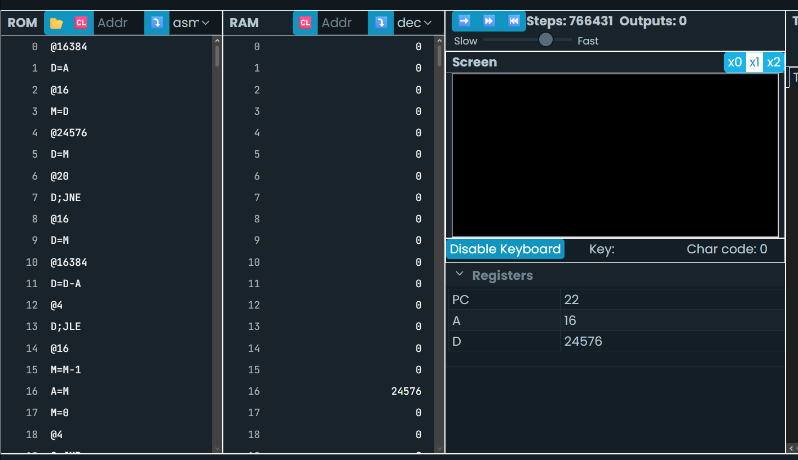
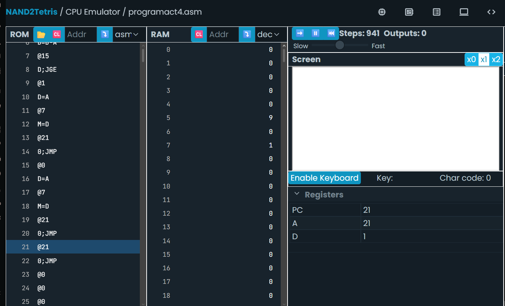
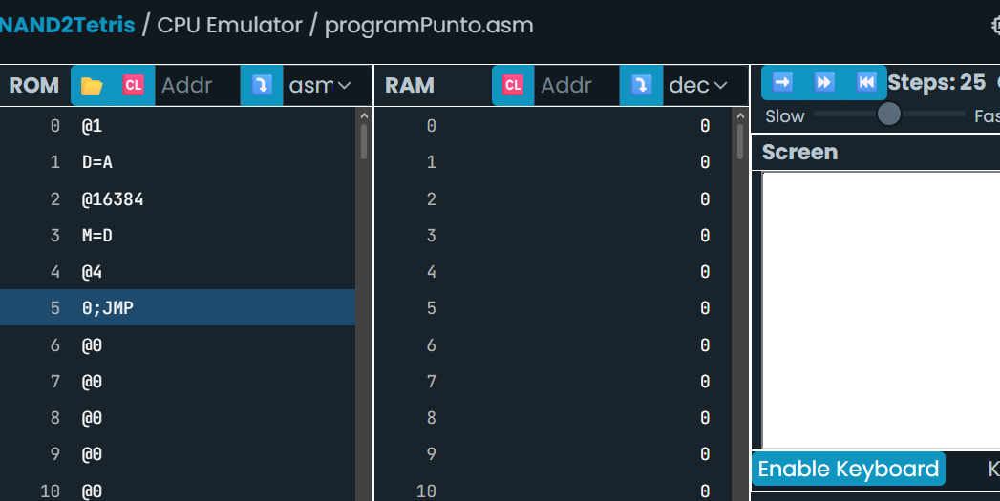
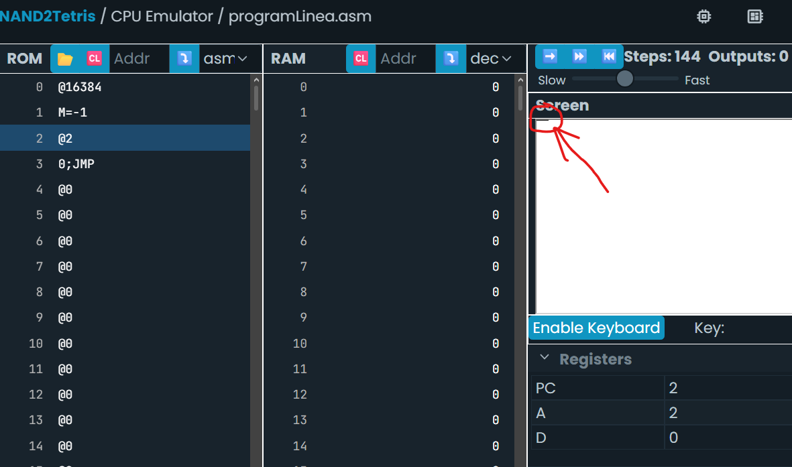
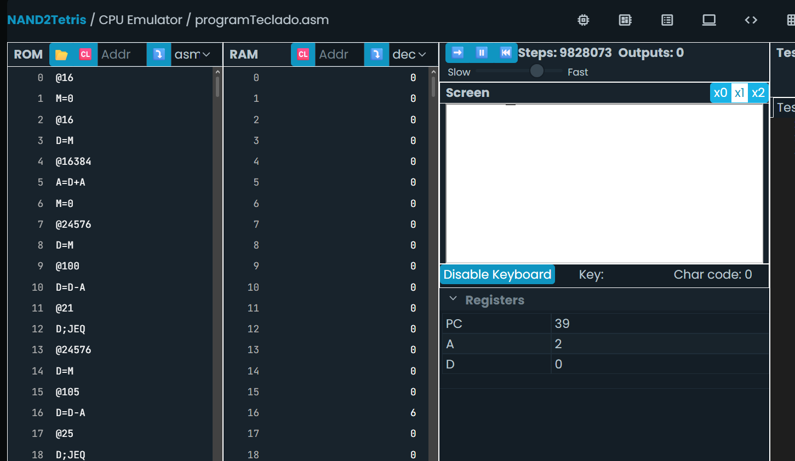

#" Sesión 3. Instrucciones, ALU, registros, saltos y control de flujo en Hack

### Actividad 3: Explorando la arquitectura del computador Hack

```nasm
@SCREEN
D=A
@i
M=D //i=16384

(READKEYBOARD)
@KBD
D=M
@KEYPRESSED
D;JNE // si valor en D /=/ salta a keypressed (que sería si se toca una tecla en el keyboard)
@i //al no presionarse tecla, realiza este bucle
D=M
@SCREEN
D=D-A
@READKEYBOARD
D;JLE
@i
M=M-1
A=M
M=0
@READKEYBOARD
0;JMP

(KEYPRESSED) // Toma culquier tecla porque basta con que sea diferente de cero
@i //Al presionar tecla, realiza este bucle
D=M
@KBD
D=D-A
@READKEYBOARD
D;JGE
@i
A=M
M=-1
@i
M=M+1
@READKEYBOARD
0;JMP
```


```
## *Experimento*

- Antes de ejecutar cada instrucción vas a predecir qué crees que va a suceder. Es muy importante que hagas esto, de esta manera tu mismo puedes saber si estás entendiendo el programa.
- Luego, ejecuta la instrucción y observa el resultado.
- Si te equivocas, reflexiona sobre por qué tu predicción no fue correcta.
```


### Tipos de instrucciones

#### El lenguaje tiene solo dos tipos:

- Instrucción A (@valor o @símbolo): carga un valor de 15 bits en el registro A. Ej: @SCREEN, @i, @KEYPRESSED.   
- Instrucción C (dest=comp;jump): ejecuta una computación de la ALU y opcionalmente guarda el resultado y/o salta. Ej: D=D-A, D;JLE, 0;JMP.   

#### El programa alterna entre estos dos tipos:

- Leer teclado y mostrar en pantalla   
- Leer teclado: @KBD + D=M → trae a D el código de la tecla actual.   
- Escribir pantalla: se usa i como puntero a una palabra de la memoria de pantalla. A=M (donde M es RAM[i]) hace que A apunte a esa palabra de pantalla, y luego M=-1 (todos los bits en 1 = negro) o M=0 (blanco) pinta 16 píxeles horizontales de una vez.   

El bucle se simula con etiqueta + salto condicional o incondicional hacia atrás:

```
(READKEYBOARD)
etc
@READKEYBOARD
0;JMP     // salto incondicional (0 siempre es "verdadero" para JMP) → vuelve a la etiqueta
```

``` asm
@i
D=M
@SCREEN
D=D-A       // D = i - SCREEN
@READKEYBOARD
D;JLE       // si D <= 0, salta (equivale a "if (i - SCREEN <= 0) goto READKEYBOARD")
```
# Paso - Instrucción- Predicción
1|	@SCREEN|	  &emsp;  &emsp;    &emsp;    A = 16384   
2|	D=A|	    &emsp;     &emsp;  &emsp;       D = 16384   
3|	@i|	        &emsp;        &emsp;  &emsp;    A = dirección de i (ej. 16)   
4|	M=D|	    &emsp;     &emsp;  &emsp;       RAM[16] = 16384 → i queda "apuntando" justo después de la pantalla   
5|	@KBD|	     &emsp;   &emsp;   &emsp;     A = 24576   
6|	D=M|	        &emsp;  &emsp;  &emsp;    D = RAM[24576] = valor de tecla (0 si nada presionado)   
7|	@KEYPRESSED|	&emsp;   &emsp;  &emsp;   A = dirección de la etiqueta KEYPRESSED   
8|	D;JNE|	          &emsp;  &emsp;  &emsp;  si D≠0 salta; si no hay tecla, D=0 → no salta, continúa   
9|	@i → D=M|	     &emsp;  &emsp;   &emsp;  D = 16384   
10|	@SCREEN → D=D-A|     &emsp; &emsp; &emsp; D = 16384-16384 = 0   
11|	@READKEYBOARD → D;JLE|	&emsp; &emsp;  &emsp;  D=0 → 0≤0 es verdadero → salta a READKEYBOARD (pantalla ya está limpia, no hay nada que borrar)   


```
## **Bitácora**

Reporta en tu bitácora de aprendizaje:

- Identifica una instrucción que use la ALU y explica qué hace.
- ¿Para qué sirve el registro PC?
- ¿Cuál es la diferencia entre @i y @READKEYBOARD?
- Describe qué se necesita para leer el teclado y mostrar información en la pantalla.
- Identifica un bucle en el programa y explica su funcionamiento.
- Identifica una condición en el programa y explica su funcionamiento.
```


**Instrucción con ALU**
> `D=D-A` → la ALU resta A de D y guarda el resultado en D. Esa resta también genera las señales de cero/negativo que usa el salto siguiente.

**¿Para qué sirve el PC?**
> Guarda la dirección de la siguiente instrucción a ejecutar. Normalmente avanza de a uno; en un salto que se cumple, toma el valor de A en su lugar. Es el contador de pasos y se necesita para los bucles y condicionales.

**`@i` vs `@READKEYBOARD`**
> `@i` apunta a una variable en RAM. `@READKEYBOARD` apunta a una etiqueta en ROM

**Leer teclado / mostrar pantalla**
> Teclado: `@KBD` + `D=M` lee el código de tecla desde la dirección fija 24576. Pantalla: escribir `-1` (negro) o `0` (blanco) en las direcciones 16384–24575, usando un puntero (`i`) que recorre esas posiciones una por una.

**Bucle**
```
(READKEYBOARD)
...
@READKEYBOARD
0;JMP
```
`0;JMP` es un salto incondicional que regresa siempre a `READKEYBOARD`, formando un bucle infinito que revisa el teclado en cada vuelta.

**Condición**
```
@i
D=M
@KBD
D=D-A
@READKEYBOARD
D;JGE
```
Equivale a `if (i - KBD >= 0) goto READKEYBOARD`: si el puntero ya llegó al final de la pantalla, deja de pintar y vuelve al inicio.


### Actividad 4: Control de flujo con saltos

```
Vamos a resolver juntos este problema:

Escribe un programa que compare el valor almacenado en la dirección de memoria 5 con el valor 10. Si el valor es menor que 10, guarda el valor 1 en la dirección 7. Si el valor es mayor o igual a 10, guarda el valor 0 en la dirección 7.

## **Bitácora**

- Escribe tu mismo el programa.
- Simula paso a paso. Recuerda la metodología: predice, ejecuta, observa y reflexiona.
```


```asm
@9
D=A // Guarda valor 9 en D
@5 
M=D // Almacena el valor de D (9) en la dirección de memoria 5
D=M // Ahora sí lo lee desde la dirección 5 el valor que tiene (que le di yo), un poco redundante acá pero es importante, podrías saltar el paso de darle el valor de 9 del inicio y hacerlo manual pero preferí ponerselo desde el código por preferencia propia
@10
D=D-A // Resta el valor de D (9) con el 10 al que apunta A
@GREATEREQUAL
D;JGE // Saltar a dirección apuntada (GREATEREQUAL) si D >= valor de A (10)
(LOWERTHAN) //Se declara el Menor Que
@1 
D=A // Da valor 1 a D
@7 
M=D // Almacena el valor de D (1) en la dirección 7
@END // Apunta a etiqueta de fin
0;JMP // Que salte a la dirección de fin después de cumplir la instrucción de menor y que no haga la de mayor
(GREATEREQUAL) // Si el salto sí se da, seguir aquí, se declara Mayor o Igual Que
@0
D=A // Da valor 0 a D
@7
M=D // Almacena el valor de D (0) en la dirección 7
@END // Apunta a etiqueta de fin
0;JMP // Que salte a la dirección de fin después de cumplir la instrucción, quizá redundante en este caso pero solo por si las moscas lo dejo
(END) // Declaración de instrucción Final
@END // Se apunta a sí misma
0;JMP // Hace un salto incondicional a sí misma sin parar para formar un pseudobucle de fin
```



## Sesión 4. Memoria mapeada, pantalla, teclado y programas interactivos simples

### Actividad 5: Implementando un ciclo simple

```
“Crea un programa que use un ciclo para sumar los números del 1 al 5 y guarde el resultado en la dirección de memoria 12.”

## **Bitácora**

- Escribe tu mismo el programa.
- Simula paso a paso. Recuerda la metodología: predice, ejecuta, observa y reflexiona.
```

```asm
@i
M=1        // i = 1 (contador)
@12
M=0        // suma = 0 (acumulador, empieza en 0 porque aún no sumamos nada)
(SUMLOOP)
@i
D=M        
@5
D=D-A      
@END
D;JGT      // si i > 5, termina
@i
D=M        
@12
M=D+M      
@i
M=M+1      
@SUMLOOP
0;JMP      // vuelve al inicio del bucle
(END)
@END
0;JMP
```

### Actividad integrada: Dibujando un punto en la pantalla


```
Traduce este programa a lenguaje C++ para que relaciones cómo los conceptos de alto nivel se traducen a bajo nivel.

## **Bitácora**

- Escribe tu mismo ambos programas.
- Simula paso a paso el programa en ensamblador. Recuerda la metodología: predice, ejecuta, observa y reflexiona.
```

``` asm
@1
D=A
@SCREEN
M=D 
(END)
@END
0;JMP
```


```cpp
#include <cstdint>

uint16_t screen[8192] = {0}; // memoria mapeada de pantalla: 32 words x 256 filas

int main() {
    screen[0] = 1; // enciende el bit 0 -> pixel superior izquierdo en negro
    return 0;
}
```

### Actividad integrada: Dibujando una línea horizontal


```
## **Bitácora**

- Escribe tu mismo los programas.
- Simula paso a paso el programa ensamblador. Recuerda la metodología: predice, ejecuta, observa y reflexiona.
```

```asm
@i
M=0           

(LOOP)
@i
D=M
@32
D=D-A          // D = i - 32
@END
D;JGE          // si i >= 32, ya recorrimos toda la fila -> termina

@i
D=M
@SCREEN
A=D+A         
M=-1           // pinta esos 16 pixeles de negro

@i
M=M+1          // i++

@LOOP
0;JMP

(END)
@END
0;JMP
```

```cpp
#include <cstdint>

uint16_t screen[8192] = {0};

int main() {
    for (int i = 0; i < 32; i++) {
        screen[i] = 0xFFFF; // cada word cubre 16 pixeles; 32 words = fila completa (512 px)
    }
    return 0;
}
```


### Actividad integrada: Entrada salida interactiva

```
## **Bitácora**

- Escribe los programas.
- Simula paso a paso en lenguaje ensamblador. Recuerda la metodología: predice, ejecuta, observa y reflexiona.
```
``` asm
@i
M=0

(LOOP)
@i
D=M
@SCREEN
A=D+A
M=0    

@KBD
D=M
@100
D=D-A
@MOVERIGHT
D;JEQ        

@KBD
D=M
@105
D=D-A
@MOVELEFT
D;JEQ      

@DRAW
0;JMP     

(MOVERIGHT)
@i
M=M+1
@DRAW
0;JMP

(MOVELEFT)
@i
M=M-1
@DRAW
0;JMP

(DRAW)
@i
D=M
@SCREEN
A=D+A
M=-1        

(WAITRELEASE)
@KBD
D=M
@WAITRELEASE
D;JNE        

@LOOP
0;JMP
```

```cpp
#include <cstdint>

uint16_t screen[8192] = {0}; // memoria mapeada de pantalla: 32 words x 256 filas
int i = 0;                   // posición actual de la línea (offset en words desde SCREEN)

char readKeyboard(); // simula leer la dirección KBD (0 = ninguna tecla presionada)

int main() {
    while (true) {
        screen[i] = 0; // borra la línea en la posición actual

        char key = readKeyboard();

        if (key == 'd') {
            i = i + 1; // mover a la derecha
        } else if (key == 'i') {
            i = i - 1; // mover a la izquierda
        }
        // si es cualquier otra tecla (o ninguna), i no cambia y se redibuja en el mismo sitio

        screen[i] = 0xFFFF; // dibuja la línea en la nueva posición

        // debounce: espera a que se suelte la tecla antes de repetir el ciclo
        while (readKeyboard() != 0) {
            // no hace nada, solo espera
        }
    }

    return 0;
}
```


https://confusion-snapper-025.notion.site/Sesiones-3-y-4-39ce8161b2a18018a926c17f32c49926