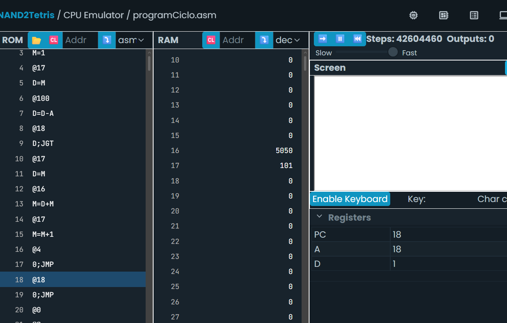
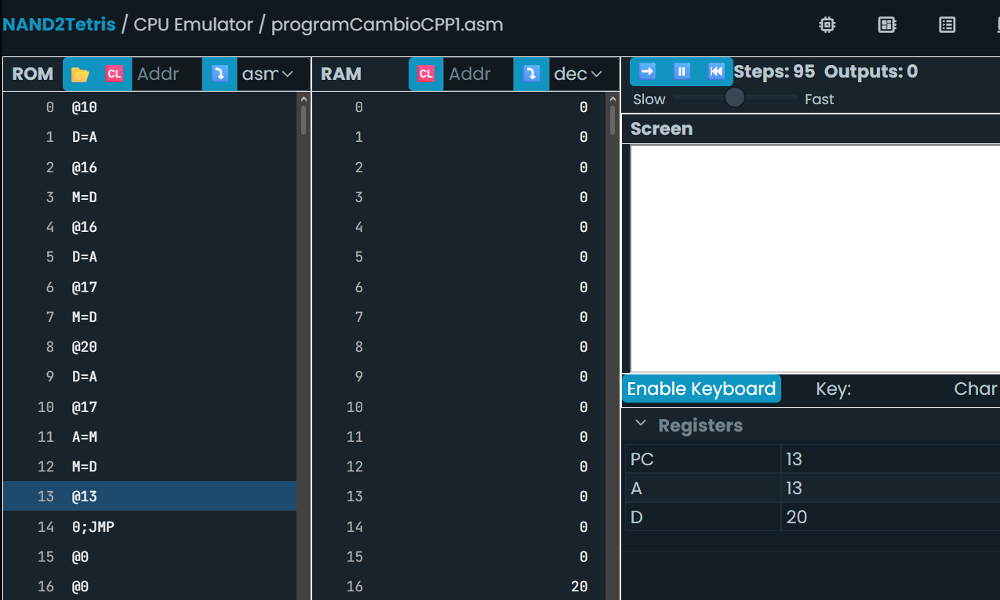
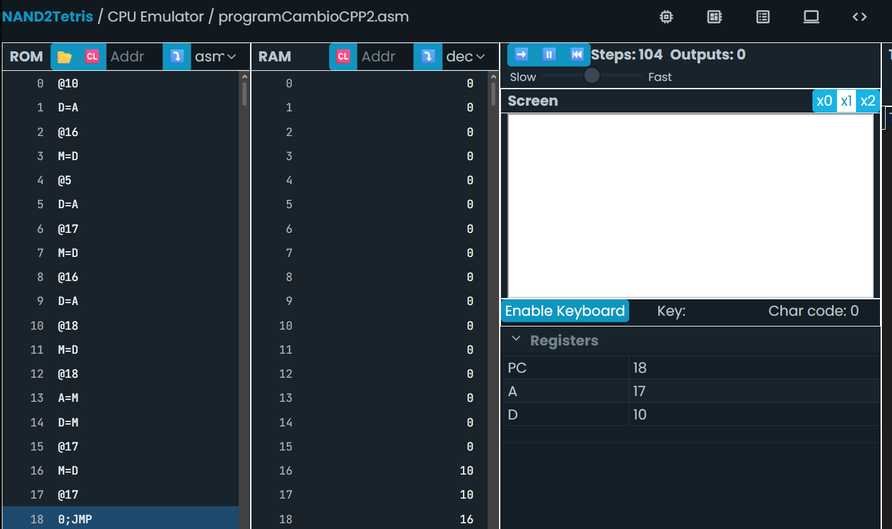
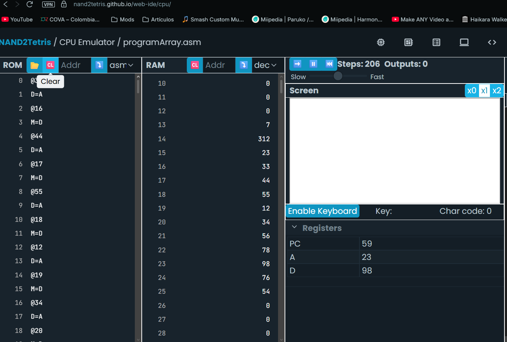

# Sesiones 5, 6 y 7


## Sesión 5. Traducción de ciclos y condicionales entre C++ y ensamblador

### Actividad integrada: Convierte un ciclo while en un ciclo for


Vamos a transformar este programa a su equivalente usando un ciclo for:

```
- Analiza los programas con while y for asegúrate de entender por qué son equivalentes.
- Convierte la versión del for a ensamblador.
- No olvides comprobar el funcionamiento de los programas en ensamblador en el simulador.
- Compara las versiones en ensamblador del while y del for. ¿Qué puedes concluir?

## **Bitácora**

Escribe en tu bitácora el programa en ensamblador y las conclusiones que has sacado de la comparación entre los dos programas.
```
```asm
@sum
M=0       
@i
M=1       

(LOOP)
@i
D=M        
@100
D=D-A      
@END
D;JGT      
@i
D=M        
@sum
M=D+M      
@i
M=M+1      
@LOOP
0;JMP      

(END)
@END
0;JMP      
```

Conclusivamente, en assembly, while y for se traducen como lo mismo

## Sesión 6. Punteros, arreglos y relación entre direcciones de memoria y código de alto nivel

### Actividad integrada: Punteros

```
## **Bitácora**

Convierte estos programas a ensamblador y realiza la simulación paso a paso. Recuerda la metodología: predice, ejecuta, observa y reflexiona.
```

```cpp
int a = 10;
int* p;
p = &a;
*p = 20;

int a = 10;
int b = 5;
int *p;
p = &a;
b = *p;
```

Programa 1
``` asm
@10
D=A
@a
M=D        

@a
D=A        
@p
M=D        

@20
D=A
@p
A=M        
M=D        

(END)
@END
0;JMP
```


Programa 2
```asm
@10
D=A
@a
M=D        

@5
D=A
@b
M=D        

@a
D=A
@p
M=D        

@p
A=M        
D=M        
@b
M=D        

(END)
@END
0;JMP
```


### Actividad integrada: Experimenta con arreglos

Los arreglos son colecciones de datos en la memoria.

Considera el siguiente programa

```cpp
int arr[] = {33,44,55,12,34,56,78,98,76,54};
int sum = 0;
for (int j = 0; j < 10; j++) {
	sum = sum + arr[j];
	}
```

```
## **Bitácora**

- Implementa el programa anterior en lenguaje ensamblador aplicando el concepto de punteros.
- Considera que los datos del arreglo están almacenados **desde** la dirección 16. Inicializa el arreglo en lenguaje ensamblador.
- Simula paso a paso el programa en ensamblador. Recuerda la metodología: predice, ejecuta, observa y reflexiona.
- Construye tu programa PASO A PASO mediante pruebas. Indica qué característica vas a implementar con cada prueba y cómo la probaste. Incluye capturas de pantalla de las pruebas que realizaste.
- Muestra el programa final y cómo lo probaste. Incluye capturas de pantalla.
```

### Paso 1: Iniciar Arreglo
``` asm
@33
D=A
@16
M=D
@44
D=A
@17
M=D
@55
D=A
@18
M=D
@12
D=A
@19
M=D
@34
D=A
@20
M=D
@56
D=A
@21
M=D
@78
D=A
@22
M=D
@98
D=A
@23
M=D
@76
D=A
@24
M=D
@54
D=A
@25
M=D

(END)
@END
0;JMP
```

### Paso 2: Bucle
``` asm
@R13
M=0

(LOOP)
@R13
D=M
@10
D=D-A
@END
D;JGE

@R13
D=M
@16
D=D+A      // D = 16+j = dirección de arr[j]
@R15
M=D        // R15 = puntero a arr[j]

@R13
M=M+1      // j++

@LOOP
0;JMP

(END)
@END
0;JMP
```

### Final

``` asm
// Inicializar arreglo
@33
D=A
@16
M=D
@44
D=A
@17
M=D
@55
D=A
@18
M=D
@12
D=A
@19
M=D
@34
D=A
@20
M=D
@56
D=A
@21
M=D
@78
D=A
@22
M=D
@98
D=A
@23
M=D
@76
D=A
@24
M=D
@54
D=A
@25
M=D

@R14
M=0
@R13
M=0

(LOOP)
@R13
D=M
@10
D=D-A
@END
D;JGE     

@R13
D=M
@16
D=D+A      
@R15
M=D       

@R15
A=M        
D=M        

@R14
M=D+M      

@R13
M=M+1      

@LOOP
0;JMP

(END)
@END
0;JMP
```



## Sesión 7.

### Autoevaluación

**Mirando hacia adentro: autoevaluación de conceptos y proceso**

El objetivo de esta actividad es doble. Primero, que puedas recuperar de tu memoria los conceptos fundamentales de la unidad sin ayuda de tus notas. Este proceso de “recordar” es una de las formas más efectivas de fortalecer tu memoria a largo plazo. Segundo, que reflexiones sobre *cómo* has aprendido, para que puedas identificar qué estrategias te funcionan mejor.

## **Bitácora**

**Sin consultar tus apuntes**, el simulador o cualquier otro material, responde con tus propias palabras a las siguientes preguntas. ¡No te preocupes por la perfección! El objetivo es ver qué recuerdas ahora mismo.

**Parte 1: recuperación de conocimiento (retrieval practice)**

1. Describe con tus palabras las tres fases del ciclo Fetch-Decode-Execute. ¿Qué rol juega el Program Counter (PC) en este ciclo?
> Fetch: se busca en la ROM la instrucción ubicada en la dirección que indica el PC. 
> Decode: se interpreta el código binario de esa instrucción — si es tipo A o tipo C
> Execute: la ALU realiza la operación, el resultado se escribe en los destinos indicados (A, D y/o M), y se actualiza el PC
> El PC es literalmente lo que hace posible el ciclo: es el "puntero" que le dice al CPU cuál es la siguiente instrucción a buscar
2. ¿Cuál es la diferencia fundamental entre una instrucción-A (que empieza con `@`) y una instrucción-C (que involucra `D`, `M`, `A`, etc.) en el lenguaje ensamblador de Hack? Da un ejemplo de cada una.
> La instrucción-A (@valor o @símbolo) solo carga un número de 15 bits en el registro A — no involucra la ALU ni puede modificar D o M directamente. La instrucción-C (dest=comp;jump) sí usa la ALU: toma valores de A, D y/o M, realiza una computación, opcionalmente guarda el resultado en uno o más destinos, y opcionalmente evalúa una condición de salto. 
> Ejemplo de A: @100 (A=100). 
> Ejemplo de C: D=D+A (calcula D+A con la ALU y guarda el resultado en D).
3. Explica la función de los siguientes componentes del computador Hack: el registro D, el registro A y la ALU.
> El registro D es un registro de datos de propósito general: guarda valores temporales para usarlos en cálculos posteriores. 
> El registro A tiene doble función: puede actuar como registro de datos normal, pero también determina la dirección de memoria que se está accediendo (ya sea de ROM, cuando se usa como destino de salto, o de RAM, cuando se referencia M). 
> La ALU es el componente que realiza las operaciones aritméticas y lógicas (suma, resta, AND, OR, negación, comparaciones con cero, etc.) tomando como entradas los valores de D y de A (o M).
4. ¿Cómo se implementa un salto condicional en Hack? Describe un ejemplo (p. ej., saltar si el valor de D es mayor que cero).
> Se implementa con una instrucción-C que evalúa una computación y, según su signo/valor, decide si saltar a la dirección que quedó cargada previamente en A mediante una instrucción-A.
``` asm
@ETIQUETA
D;JGT      // si D > 0, salta a ETIQUETA; si no, continúa a la siguiente instrucción
```
5. ¿Cómo se implementa un loop en el computador Hack? Describe un ejemplo (p. ej., un loop que decremente un valor hasta que llegue a cero).
> El patrón general de todo loop en Hack es siempre el mismo: una etiqueta de inicio, una condición de salida evaluada con salto condicional hacia adelante, el cuerpo del bucle, y un salto incondicional (0;JMP) de regreso a la etiqueta.
6. ¿Cuál es la diferencia entre la instrucción `D=M` y la instrucción `M=D`?
> D=M lee: copia el valor que está en la dirección de memoria a la que apunta A, y lo guarda en D. M=D escribe: toma el valor que está en D y lo guarda en la dirección de memoria a la que apunta A
7. Describe brevemente qué se necesita para leer un valor del teclado (`KBD`) y para “pintar” un pixel en la pantalla (`SCREEN`).
> Para leer el teclado: @KBD (carga la dirección fija 24576 en A) seguido de D=M (trae a D el código de la tecla presionada actualmente; 0 si no hay ninguna). Para pintar en pantalla: se necesita @SCREEN (o una dirección calculada a partir de SCREEN, si se quiere pintar en otra posición que no sea el primer word) para que A apunte a esa dirección de memoria mapeada, y luego M=-1 (pinta 16 pixeles de negro, todos los bits en 1) o M=0 (blanco, todos los bits en 0).
8. Explica cómo se representa y manipula un puntero en el lenguaje ensamblador de Hack. Describe las operaciones equivalentes a `p = &a` (asignar dirección) y `p = 20` (escribir a través del puntero) usando instrucciones de ensamblador.
> Un puntero en Hack es una variable normal en RAM que se usa para guardar una dirección en vez de un dato "de negocio". No hay tipo de dato especial. p = &a (asignar la dirección de a a p) se traduce cargando A con la dirección de a mediante D=A (no D=M, porque no queremos el valor de a, sino su dirección) y guardando ese D en p
9. ¿Cómo implementarías el acceso a un elemento de un arreglo, como `arr[j]`, en lenguaje ensamblador? Describe el rol de la dirección base del arreglo y el índice `j` en esta operación.
> Se calcula la dirección real del elemento sumando la dirección base del arreglo más el índice: dirección = base + j. Con j ya en D:
> Esa dirección calculada se guarda típicamente en un registro temporal (R13-R15) usado como puntero, y luego se accede al dato con A=M seguido de D=M (leer) o M=D (escribir). La dirección base es fija (dónde empieza el arreglo en memoria) y el índice j es lo que varía en cada iteración del recorrido, de modo que sumarlos da la dirección exacta de cada elemento distinto.

**Parte 2: reflexión sobre tu proceso (metacognición)**

1. ¿Cuál fue el concepto o actividad más desafiante de esta unidad para ti y por qué?
> La de leer el keyboard diría yo porque a partir de ahí se extienden mucho los bucles y me pierdo con punteros
2. La metodología de “predecir, ejecutar, observar y reflexionar” fue central en nuestras actividades. ¿En qué momento esta metodología te resultó más útil para entender algo que no tenías claro?
> Al momento de buscar llenar pixeles en la pantalla para saber si calculé bien la cantidad exacta de bytes para formar una línea entera
3. Describe un momento “¡Aha!” que hayas tenido durante esta unidad. ¿Qué estabas haciendo cuando ocurrió?
> Estaba tratando de entender cómo funcionaba el KBD para lo suyo
4. Pensando en la próxima unidad, ¿qué harás diferente en tu proceso de estudio para aprender de manera más efectiva?
> Estudiar C++ porque ando colgado ahí
5. ¿Cuál fue el concepto más abstracto o difícil de “traducir” de C++ a ensamblador en esta unidad (punteros, ciclos, arreglos)? ¿Qué hiciste para lograr entenderlo?
> Punteros, tuve que entenderlo similar a como lo haría con un ciclo
6. En la actividad de arreglos se sugirió construir el programa “PASO A PASO mediante pruebas”. ¿Cómo te ayudó este enfoque a manejar la complejidad del problema?
> Me ayudó a revisar cada paso para que estuviera bien
7. ¿Qué concepto de bajo nivel te sientes más seguro de poder identificar cuando lo veas implementado en C++?
> Pasar un valor de registro A y D a la RAM
