# Sesión 1

# **Actividad 1: Hola mundo**


```cpp
#include <iostream>
int main(){
	std::cout << "Hello World!\n";
	}
```

```cpp
#include <iostream>
int sum(int a, int b){
	return a + b;
	}

int main(){
	int a = 5;
	int b = 7;
	std::cout << "La suma de " << a << " y " << b << " es " << sum(a, b) << "\n";
	}
```

```
**Reflexión de esta actividad:**

1. ¿Para qué sirven los breakpoints?
2. ¿Para qué se usa la ventana de depuración Autos?
</aside>
```

1. Para depurar paso por paso y ver qué se ejecuta en una específica parte
2. Para revisar los valores y cambios de las variables por cada línea de código


# **Actividad 2: Paso por valor y paso por referencia**

Analizaremos el concepto de paso de parámetros en C++ y cómo se comporta el paso por valor, por referencia y por puntero.

- **Predicción**: antes de ejecutar el programa, predice la salida de cada función y explica el resultado.
- ¿Qué diferencias observas en el comportamiento de `a, b` y `c` tras cada llamada?
- ¿Por qué ocurre esta diferencia?

```cpp
#include <iostream>
using namespace std;

// Función que modifica el parámetro pasado por valor
void modificarPorValor(int n) {
	cout << "Dentro de modificarPorValor, valor inicial: " << n << endl;
	n += 5;
	cout << "Dentro de modificarPorValor, valor modificado: " << n << endl;
	}

// Función que modifica el parámetro pasado por referencia
void modificarPorReferencia(int &n) {
	cout << "Dentro de modificarPorReferencia, valor inicial: " << n << endl;
	n += 5;
	cout << "Dentro de modificarPorReferencia, valor modificado: " << n << endl;
	}

// Función que modifica el parámetro utilizando punteros
void modificarPorPuntero(int *n) {
	cout << "Dentro de modificarPorPuntero, valor inicial: " << *n << endl;
	*n += 5;
	cout << "Dentro de modificarPorPuntero, valor modificado: " << *n << endl;
	}

int main() {    int a = 10;    int b = 10;    int c = 10;
    cout << "Valor inicial de a (paso por valor): " << a << endl;
    cout << "Valor inicial de b (paso por referencia): " << b << endl;
    cout << "Valor inicial de c (paso por puntero): " << c << endl;
    cout << "\nLlamando a modificarPorValor(a)..." << endl;
    modificarPorValor(a);
    cout << "Después de modificarPorValor, valor de a: " << a << endl;
    cout << "\nLlamando a modificarPorReferencia(b)..." << endl;
    modificarPorReferencia(b);
    cout << "Después de modificarPorReferencia, valor de b: " << b << endl;
    cout << "\nLlamando a modificarPorPuntero(&c)..." << endl;
    modificarPorPuntero(&c);
    cout << "Después de modificarPorPuntero, valor de c: " << c << endl;
    return 0;
    }
```

Analicemos el código línea por línea y expliquemos en detalle qué sucede en cada función y cómo se comporta el paso de parámetros de diferentes maneras.

1. Inclusión de librerías y uso del espacio de nombres:

```cpp
#include <iostream>
using namespace std;
```

- `iostream`: es la librería estándar de C++ para poder usar `cout` y otras funcionalidades de entrada/salida.
- `using namespace std;`: permite usar los elementos del espacio de nombres std directamente, sin tener que escribir std:: cada vez como en la actividad anterior.
1. Función `modificarPorValor`

```cpp
void modificarPorValor(int n) {
	cout << "Dentro de modificarPorValor, valor inicial: " << n << endl;
	n += 5;
	cout << "Dentro de modificarPorValor, valor modificado: " << n << endl;
	}
```

### Paso por Valor:

- **Parámetro**: la función recibe n por valor. Esto significa que se hace una copia del valor de la variable que se pasa desde `main()`.
- **Efecto**: las modificaciones que se realizan en n dentro de la función no afectan a la variable original, ya que se trabaja sobre una copia.
- **Salida**: dentro de la función se imprimen dos mensajes: uno antes y otro después de sumar 5 a n. Sin embargo, fuera de la función, la variable original permanece igual.
1. Función `modificarPorReferencia`

```cpp
void modificarPorReferencia(int &n) {
	cout << "Dentro de modificarPorReferencia, valor inicial: " << n << endl;
	n += 5;
	cout << "Dentro de modificarPorReferencia, valor modificado: " << n << endl;
	}
```

### Paso por Referencia (con Referencias):

- Parámetro: se declara `int &n`, lo que significa que n es una referencia a la variable original.
- Efecto: la variable `n` en la función es un alias de la variable pasada. Cualquier cambio realizado en `n` afecta directamente a la variable original.
- Salida: la suma de 5 a `n` dentro de la función modifica la variable original, y esto se refleja fuera de la función.
1. Función `modificarPorPuntero`

```cpp
void modificarPorPuntero(int *n) {
	cout << "Dentro de modificarPorPuntero, valor inicial: " << *n << endl;
	*n += 5;
	cout << "Dentro de modificarPorPuntero, valor modificado: " << *n << endl;
	}
```

### Paso por Puntero:

- Parámetro: la función recibe un puntero `int *n`, que contiene la dirección de memoria de una variable.
- Acceso al Valor: para acceder y modificar el valor apuntado, se utiliza el operador de indirección (`*`).
- Efecto: al modificar `*n`, se está cambiando el valor de la variable original a la que apunta el puntero.
- Salida: al igual que en el caso de la referencia, el cambio (suma de 5) afecta directamente a la variable original.
1. Función `main`

```cpp
int main() {
	int a = 10;
	int b = 10;
	int c = 10;
```

Se declaran y definen tres variables enteras a, b y c, todas inicializadas en 10. Cada una se utilizará para evaluar uno de los métodos de paso de parámetros.

```cpp
cout << "Valor inicial de a (paso por valor): " << a << endl;
cout << "Valor inicial de b (paso por referencia): " << b << endl;
cout << "Valor inicial de c (paso por puntero): " << c << endl;
```

Se imprime el valor inicial de cada variable antes de cualquier modificación.

Llamada a `modificarPorValor`

```cpp
cout << "\nLlamando a modificarPorValor(a)..." << endl;
modificarPorValor(a);
cout << "Después de modificarPorValor, valor de a: " << a << endl;
```

¿Qué ocurre?

- Se llama a `modificarPorValor(a)`. Dentro de la función, `a` se pasa por valor, lo que genera una copia de `a`.
- Dentro de la función, se suma 5 a la copia y se imprimen los valores modificados.
- Al regresar a `main()`, la variable a no ha cambiado, ya que la copia modificada no afecta a la original.

Resultado Esperado:

- Dentro de la función: valor inicial: 10 y valor modificado: 15.
- Fuera de la función: a sigue siendo 10.

Llamada a `modificarPorReferencia`

```cpp
cout << "\nLlamando a modificarPorReferencia(b)..." << endl;
modificarPorReferencia(b);
cout << "Después de modificarPorReferencia, valor de b: " << b << endl;
```

¿Qué ocurre?

- Se llama a `modificarPorReferencia(b)`. Aquí, b se pasa por referencia, lo que significa que no se hace una copia: `n` es simplemente otro nombre para `b`.
- Al sumar 5 a `n` dentro de la función, `b` se modifica directamente.

Resultado Esperado:

- Dentro de la función: valor inicial: 10 y valor modificado: 15.
- Fuera de la función: `b` es 15, reflejando la modificación.

Llamada a `modificarPorPuntero`

```cpp
cout << "\nLlamando a modificarPorPuntero(&c)..." << endl;
modificarPorPuntero(&c);
cout << "Después de modificarPorPuntero, valor de c: " << c << endl;
```

¿Qué ocurre?

- Se llama a `modificarPorPuntero(&c)`, pasando la dirección de `c`.
- Dentro de la función, `n` es un puntero a c. Usando `*n`, accedemos al valor de `c`.
- Al sumar 5 a `*n`, se modifica el valor almacenado en `c`.

Resultado Esperado:

- Dentro de la función: valor inicial: 10 y valor modificado: 15.
- Fuera de la función: `c` es 15, ya que se ha modificado directamente mediante el puntero.

## **Conclusión**

### **Paso por Valor:**

La función recibe una copia del valor. Las modificaciones realizadas dentro de la función no afectan a la variable original. En este ejemplo, a sigue siendo 10 después de la llamada a `modificarPorValor`.

### **Paso por Referencia (con referencias):**

La función recibe una referencia (alias) a la variable original. Las modificaciones realizadas dentro de la función afectan a la variable original. En el ejemplo, b se convierte en 15 después de la llamada a `modificarPorReferencia`.

### **Paso por Puntero:**

La función recibe la dirección de la variable original. Accediendo al valor mediante la indirección (`*`), se puede modificar el contenido de la variable original. Así, c se convierte en 15 después de la llamada a `modificarPorPuntero`.


### Reflexión final para esta actividad:

Implementa tres versiones de una función para intercambiar (swap) los valores de dos variables enteras, utilizando:

- Paso por valor.
- Paso por referencia (usando referencias).
- Paso por puntero.

Crea un proyecto de consola en Visual Studio. Implementa las siguientes funciones:

```
`swapPorValor(int a, int b)`

Esta función debe intentar intercambiar los valores de a y b pasándolos por valor. 

<aside>
🔖

Nota: Se espera que el intercambio no afecte a las variables originales en `main()`.

</aside>

`swapPorReferencia(int &a, int &b)`

Esta función debe intercambiar los valores de a y b utilizando paso por referencia con referencias.

`swapPorPuntero(int *a, int *b)`

Esta función debe intercambiar los valores de a y b utilizando punteros. Recuerda acceder a los valores con el operador de indirección (`*`).
```

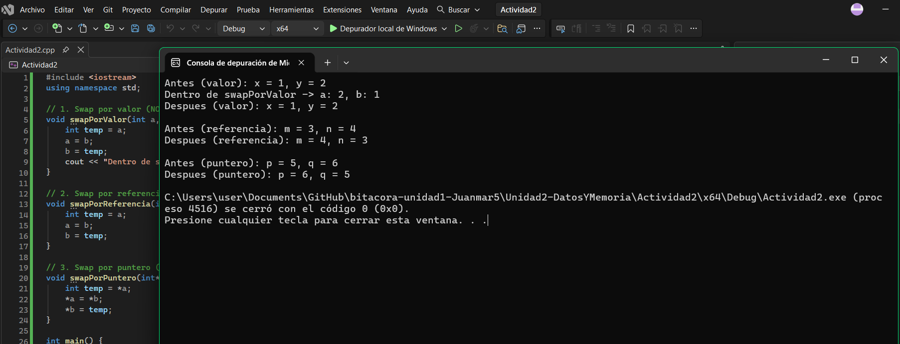

1. Muestra el código con la implementación de las funciones de `swap`.
2. Muestra los resultados de las pruebas realizadas en la función `main()`.

Código: el de arriba, con las tres funciones swap.
Resultados esperados en main():
swapPorValor: no cambia x y y afuera de la función, porque solo se intercambia la copia local (adentro de la función sí se ve el cambio, pero afuera no).
swapPorReferencia: sí cambia m y n, porque la referencia es un alias directo de la variable original.
swapPorPuntero: sí cambia p y q, porque se accede y modifica la variable original a través de su dirección de memoria con *.


# Sesión 2

# **Actividad 3: Mapa de memoria de un programa escrito en C++**

```
### Reflexión final para esta actividad:

Construye tu propio mapa de memoria indicando en qué parte del mapa se ubican las variables y constantes globales, locales, estáticas y de la memoria dinámica y en qué parte del mapa se encuentran las funciones y el mensaje de solo lectura.
```


# **Actividad 4: Experimentos**

Vas a realizar múltiples experimentos con el código de la actividad anterior para comprender cómo se comportan los segmentos de memoria en un programa C++.


## Experimento 1: modificar el segmento de texto:
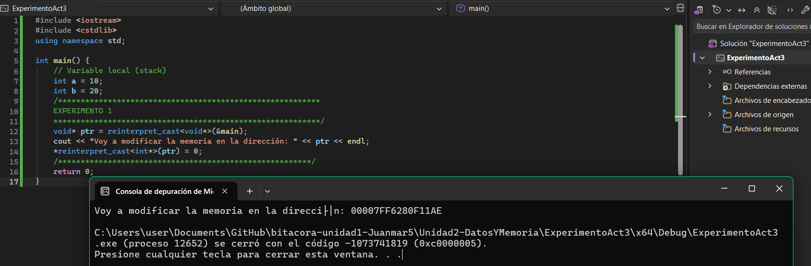

#### **¿Qué ocurre? ¿Por qué?**

- Ocurre un crash (violación de acceso / access violation). Por qué: el segmento de código es de solo lectura en el sistema operativo, así que al intentar escribir ahí (*reinterpret_cast<int*>(ptr) = 0), el sistema operativo bloquea la operación para evitar que se altere el código ejecutable.

## Experimento 2: modificar el segmento de datos (constante global):
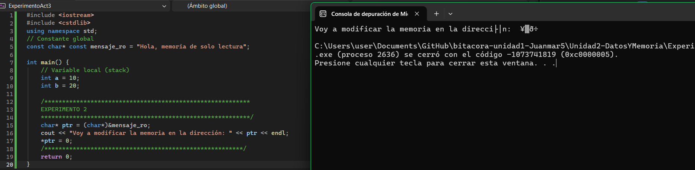

- También produce un access violation. El string literal "Hola, memoria de solo lectura" se guarda en una zona de solo lectura de memoria (segmento de datos de solo lectura), aunque el puntero mensaje_ro no sea técnicamente const en tiempo de ejecución para el compilador, el contenido apuntado sí está protegido por el sistema operativo.

## Experimento 3: modificar el segmento de datos (variables globales):
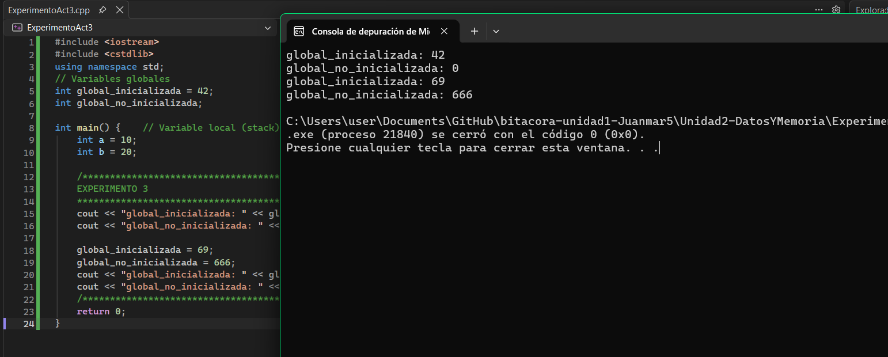

- Esto sí funciona sin error. Las variables globales (inicializadas y no inicializadas) están en una zona de datos que sí permite lectura y escritura, a diferencia del segmento de código o los literales de string. Por eso puedes cambiar global_inicializada a 69 y global_no_inicializada a 666 sin problema.

## Experimento 4: modificar la variable local estática de una función por fuera de ella:
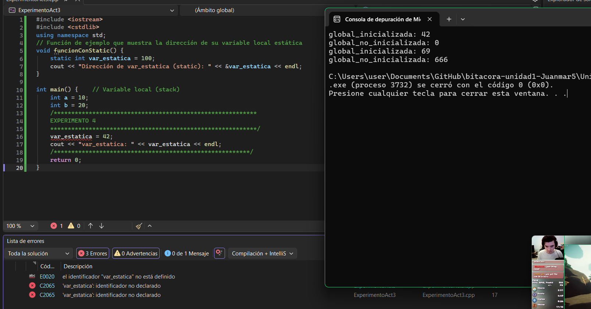

#### ¿Qué ocurre? ¿Por qué?
- La variable no se destruye al salir de la función; conserva su valor entre llamadas, porque se guarda en el segmento de datos globales/estáticos, no en el stack.
#### ¿Qué pasa con las variables cada que entras y sales de la función?
- Se crea al entrar y se destruye al salir (vive en el stack). 
#### En relación a la pregunta anterior ¿Qué pasa con las variables locales estáticas?
- La variable no se destruye al salir de la función; conserva su valor entre llamadas, porque se guarda en el segmento de datos globales/estáticos, no en el stack.

## Experimento 5: variables locales estática vs no estática:
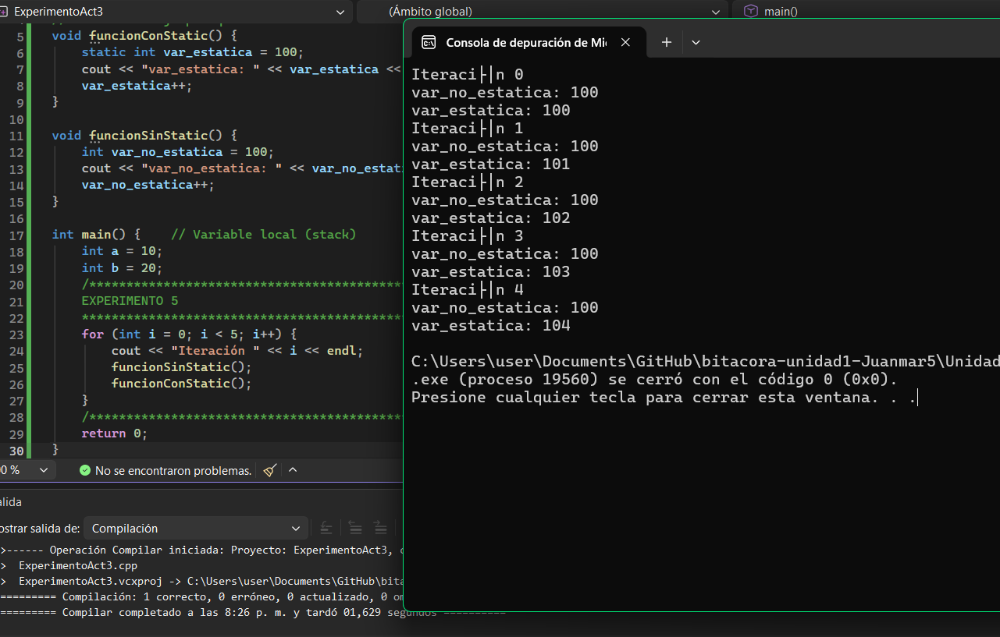

#### ¿Qué ocurre? ¿Por qué?
- var_no_estatica siempre imprime 100, porque se crea de nuevo (se reinicia) cada vez que se llama a la función.
#### Ves alguna diferencia entre las variables locales estáticas y no estáticas?
- var_estatica va acumulando: imprime 100, 101, 102, 103, 104 en las 5 iteraciones, porque solo se inicializa una vez y conserva su valor entre llamadas.
#### ¿Qué pasa con las variables cada que entras y sales de la función?
- La variable normal se destruye y se vuelve a crear; la estática persiste durante toda la ejecución del programa.

## Experimento 6: modificar el segmento de heap:
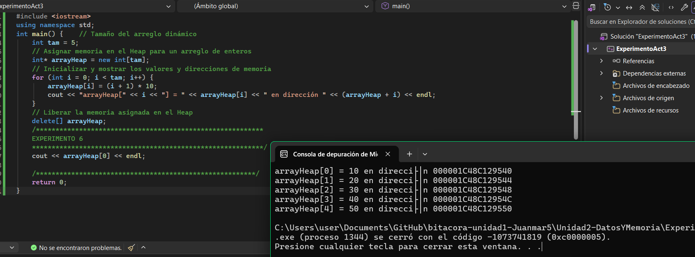

#### ¿Qué ocurre? ¿Por qué?
- La línea cout << arrayHeap[0] intenta leer memoria que ya fue liberada con delete[]. Esto es un comportamiento indefinido (undefined behavior): puede imprimir basura, un valor viejo, o incluso crashear — no hay garantía.
#### ¿Qué diferencias notas entre el comportamiento y la gestión del `Heap` en comparación con el `Stack`?
- El Stack se gestiona automáticamente (se libera solo al salir del scope); el Heap se gestiona manualmente, tú tienes que pedir (new) y liberar (delete) la memoria.
#### ¿Qué consecuencias tendría no liberar la memoria reservada con `new`?
- Un memory leak
#### ¿Por qué es importante usar `delete[]` al liberar memoria asignada para un arreglo?
- Para llamar al destructor y evitar lo de arriba


# **Actividad 5: Copia de objetos y su ubicación en memoria**

Modificada clase `Punto`:

```cpp
#include <iostream>
#include <string>
using namespace std;

class Punto {
public:
    string name;
    int x;
    int y;

    // Constructor
    Punto(string _name, int _x, int _y) : name(_name), x(_x), y(_y) {
        cout << "Constructor: Punto " << name << " (" << x << ", " << y << ") creado." << endl;
    }

    // Destructor
    ~Punto() {
        cout << "Destructor: Punto " << name << "(" << x << ", " << y << ") destruido." << endl;
    }

    // Método para imprimir valores
    void imprimir() {
        cout << "Punto " << name << "(" << x << ", " << y << ")" << endl;
    }
};

int main() {
    // Objeto original
    Punto original("original", 70, 80);
    original.imprimir();
    Punto* p = &original;

    // Copia del objeto
    Punto copia = original;
    copia.name = "copia";
    copia.x = 100;
    copia.y = 200;
    copia.imprimir();
    original.imprimir();

    p->name = "p";
    p->x = 300;
    p->y = 400;
    p->imprimir();
    original.imprimir();

    return 0;
}
```

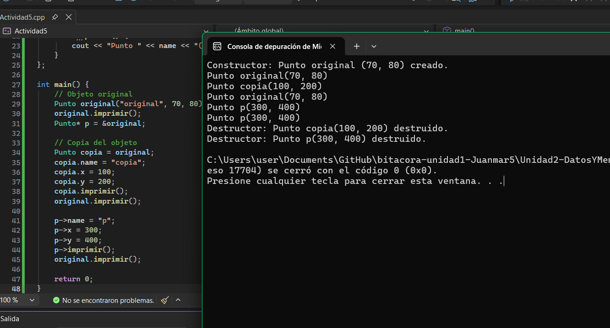
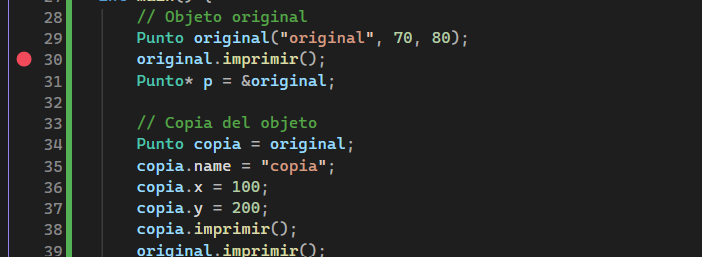

**Reflexión final para esta actividad**

1. Explica qué ocurre al copiar un objeto en C++ y en C#. ¿Qué diferencias encuentras?
- En C++: al hacer Punto copia = original, se crea una copia completamente independiente  del objeto. Por eso, al modificar copia.x, copia.y, etc., original no cambia. En cambio, p es un puntero que apunta a original, así que al modificar a través de p, sí se modifica original directamente (porque p y original son el mismo objeto en memoria).
2. ¿Qué es `copia` en C++ y en C#? ¿Es una copia independiente de `original`?
- En C#: Punto es una clase, y en C# las clases son tipos por referencia. Entonces Punto copia = original; no crea una copia nueva: copia y original apuntan al mismo objeto en memoria (en el heap de C#). Por eso al modificar copia.x, también cambia lo que ves al imprimir original — porque son la misma referencia.

# **Actividad integradora de investigación**

<aside>
📤

**Bitácora - Actividad integradora de investigación
Objetivo**: analizar un programa integral, predecir su comportamiento en memoria y verificar tus hipótesis utilizando el depurador de Visual Studio.

</aside>

### **Instrucciones**:

Considera el siguiente programa que combina varios de los conceptos que exploraste en las Actividades 1-5.

```cpp
#include <iostream>
int contador_global = 100;
void ejecutarContador() {
		static int contador_estatico = 0;
		contador_estatico++;
		std::cout << "  -> Llamada a ejecutarContador. Valor de contador_estatico: " << contador_estatico << std::endl;
}

void sumaPorValor(int a) {
		a = a + 10;
		std::cout << "  -> Dentro de sumaPorValor, 'a' ahora es: " << a << std::endl;
}
void sumaPorReferencia(int& a) {
		a = a + 10;    std::cout << "  -> Dentro de sumaPorReferencia, 'a' ahora es: " << a << std::endl;
}
void sumaPorPuntero(int* a) {
		*a = *a + 10;
		std::cout << "  -> Dentro de sumaPorPuntero, '*a' ahora es: " << *a << std::endl;
}
int main() {
		int val_A = 20;
		int val_B = 20;
		int val_C = 20;
    std::cout << "--- Experimento con paso de parámetros ---" << std::endl;
    std::cout << "Valor inicial de val_A: " << val_A << std::endl;
    sumaPorValor(val_A);
    std::cout << "Valor final de val_A: " << val_A << std::endl << std::endl;
    std::cout << "Valor inicial de val_B: " << val_B << std::endl;
    sumaPorReferencia(val_B);
    std::cout << "Valor final de val_B: " << val_B << std::endl << std::endl;
    std::cout << "Valor inicial de val_C: " << val_C << std::endl;
    sumaPorPuntero(&val_C);
    std::cout << "Valor final de val_C: " << val_C << std::endl << std::endl;
    std::cout << "--- Experimento con variables estáticas ---" << std::endl;
    ejecutarContador();
    ejecutarContador();
    ejecutarContador();
    return 0;
}
```

## **Tu Tarea**:

**A. Predicción (sin ejecutar el código):**

--- Experimento con paso de parámetros ---
Valor inicial de val_A: 20
  -> Dentro de sumaPorValor, 'a' ahora es: 30
Valor final de val_A: 20

Valor inicial de val_B: 20
  -> Dentro de sumaPorReferencia, 'a' ahora es: 30
Valor final de val_B: 30

Valor inicial de val_C: 20
  -> Dentro de sumaPorPuntero, '*a' ahora es: 30
Valor final de val_C: 30

--- Experimento con variables estáticas ---
  -> Llamada a ejecutarContador. Valor de contador_estatico: 1
  -> Llamada a ejecutarContador. Valor de contador_estatico: 2
  -> Llamada a ejecutarContador. Valor de contador_estatico: 3 

Código: main, ejecutarContador, sumaPorValor, sumaPorReferencia, sumaPorPuntero.
Datos globales/estáticos: contador_global, contador_estatico.
Stack: val_A, val_B, val_C (en main), y el parámetro a de sumaPorValor (mientras esa función se está ejecutando; después se destruye).
Heap: no se usa nada de heap en este programa.

**B. Verificación y análisis (usando el depurador):**

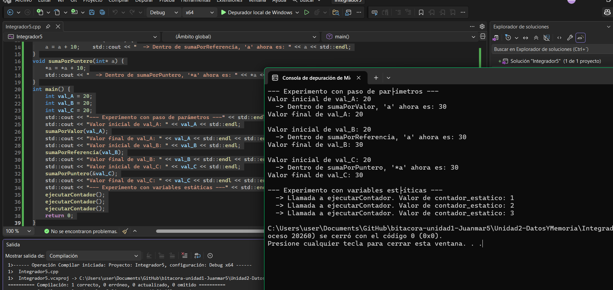
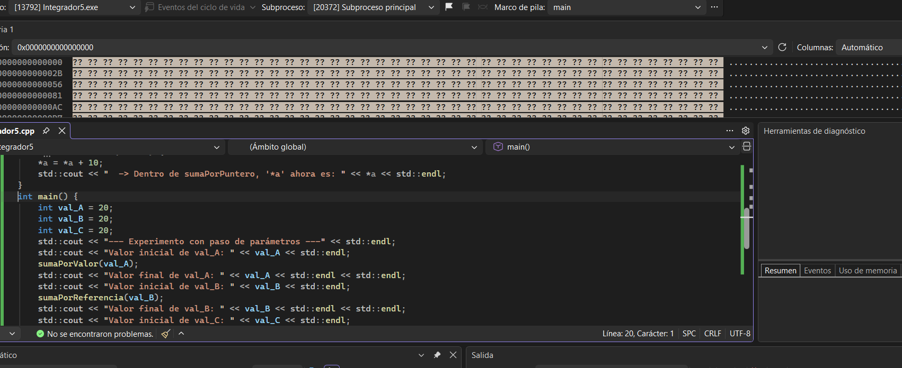
Ejecuta el programa paso a paso (F10) con un `breakpoint` al inicio de `main`.
4. Compara la salida real con tu predicción. Si hubo diferencias, explica por qué ocurrieron. Evidencia clave: capturas de pantalla antes y después de los puntos de interés (¿Cuáles son esos puntos? -> tu tarea analizarlo).
- Salió correcto a la predicción
5. Describe qué demuestran estas capturas sobre la diferencia entre los diferentes tipos de paso por parámetros analizados.
- Por valor (sumaPorValor): al entrar a la función, se crea una copia nueva de val_A llamada a, con su propia dirección de memoria en el stack. Modificar a dentro de la función no toca la memoria de val_A. Por eso, al volver a main, val_A sigue en 20.
- Por referencia (sumaPorReferencia): aquí a no es una copia, es un alias que apunta a la misma dirección de memoria que val_B. Por eso, al modificar a, se modifica directamente val_B, y el cambio se ve reflejado en main sin necesidad de retornar nada.
- Por puntero (sumaPorPuntero): a es un puntero que guarda la dirección de val_C. Para modificar el valor hay que usar *a (desreferenciar), pero el efecto es el mismo que con la referencia: se modifica la variable original directamente.
6. Explica con tus propias palabras el comportamiento de contador_estatico. ¿Por qué “recuerda” su valor entre llamadas a la función ejecutarContador? ¿En qué se diferencia de una variable local normal?
- contador_estatico "recuerda" su valor porque al ponerle static, la variable ya no vive en el stack como las variables locales normales, sino que se guarda en la zona de memoria de datos globales/estáticos, la cual existe desde que arranca el programa hasta que termina.

Una variable local normal se crea cada vez que entro a la función y se borra cuando salgo de ella, por eso siempre empieza desde cero. En cambio, contador_estatico solo se inicializa una vez (la primera vez que se llama la función) y después ya no se vuelve a crear, simplemente se queda con el valor que tenía la última vez, aunque la función haya "terminado". Por eso en las tres llamadas veo 1, 2, 3 en vez de ver 1 siempre.