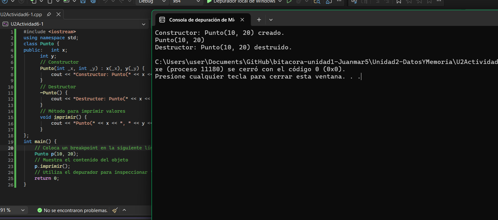
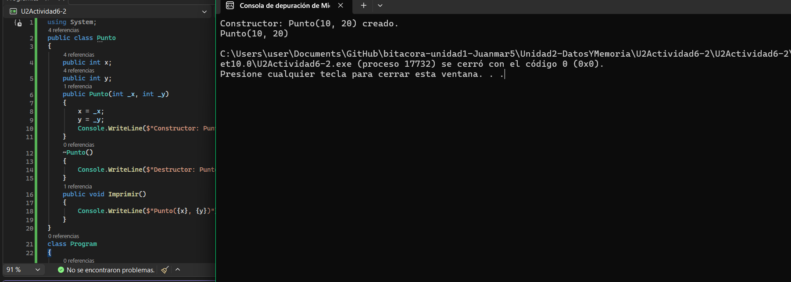

# Sesión 3

# **Apply: Aplicación 🛠**

# **Actividad 6: Hola Objeto: creación de un objeto en el stack**

Este experimento es fundamental porque conecta el concepto fundamental de POO (objetos) con este curso.

Vas a crear una clase sencilla llamada Punto que represente un punto en el espacio con dos coordenadas (`x` e `y`). Luego, crearás un objeto de esta clase en el `stack` y utilizarás el depurador para inspeccionar su contenido y dirección de memoria.

### Pasos:






**Reflexiona sobre las siguientes cuestiones**:

1. ¿Cuál es la diferencia entre un constructor y un destructor en C++?
- Constructor se ejecuta automáticamente cuando se crea el objeto, y sirve para inicializar sus valores. El destructor se ejecuta automáticamente cuando el objeto deja de existir (sale de scope o se libera), y sirve para "limpiar" o liberar lo que el objeto haya usado.
2. ¿Cuál es la diferencia entre un objeto y una clase en C++?
- La clase es la "plantilla" o el molde que define qué atributos y métodos va a tener algo (en este caso x, y, imprimir()). El objeto es una instancia concreta de esa clase, ya con valores reales (como p con x=10, y=20).
3. ¿Qué diferencia notas entre el objeto Punto en C++ y C#?
- En C++ p es un objeto real que vive directamente en el stack, con su propia dirección de memoria. En C#, p no es el objeto en sí, sino una referencia que apunta a un objeto que en realidad vive en el heap (aunque la variable p esté "declarada" como si fuera local).
4. ¿Qué es `p` en C++ y qué es `p` en C#? (en uno de ellos `p` es un objeto y en el otro es una referencia a un objeto).
- En C++, p es el objeto. En C#, p es una referencia al objeto
5. ¿En qué parte de memoria se almacena `p` en C++ y en C#?
- En C++, p se almacena en el stack. En C#, la referencia p está en el stack, pero el objeto al que apunta está en el heap (así el "objeto" nunca vive directamente en el stack en C#).
6. ¿Qué observaste con el depurador acerca de `p`? Según lo que observaste ¿Qué es un objeto en C++?
- Al inspeccionar p en C++, ves que tiene una dirección de memoria propia en el stack, y que sus campos x e y están guardados consecutivamente ahí mismo (por eso ves los bytes 0a 00 00 00 14 00 00 00, que son 10 y 20 en hex, uno después del otro). Esto demuestra que en C++, un objeto es simplemente un bloque de memoria contiguo que agrupa sus atributos, tal como una variable normal — no hay nada "mágico" o adicional.

# **Actividad 7: Objetos en el heap: creación y observación**


Ejecuta el programa en modo depuración y detente en los breakpoints para comparar:

- La dirección de pStack (ubicado en el stack).
- El valor de pHeap (la dirección del objeto en el heap).

**Reflexiona sobre lo siguiente**:

1. Explicación de la diferencia entre objetos creados en el stack y en el heap.
- En el stack el objeto se crea y se borra solo, apenas entra y sale de la función. En el heap el objeto lo creo yo con new, y si no lo borro con delete, se queda ahí ocupando memoria aunque ya no lo use.
2. `pStack` ¿Es un objeto o una referencia a un objeto?
- Es un objeto normal, directo, no es puntero ni nada raro.
3. `pHeap` ¿Es un objeto o una referencia a un objeto? Si es una referencia, ¿A qué objeto hace referencia?
- Es un puntero. Apunta al Punto(50, 60) que se creó con new en el heap.
4. Observa en Memory1 (Debug->Windows->Memory->Memory1) el contenido de la dirección de memoria de `pHeap`, recuerda escribir en la entrada de texto de Memory1 la dirección de memoria de `&pHeap` y presionar Enter. Compara el contenido de memoria con el contenido de `pHeap` en la pestaña de Locals (Debug->Windows->Locals). ¿Qué observas? ¿Qué significa esto?
- Cuando escribo &pHeap en Memory1, lo que veo ahí son los bytes que forman la dirección que guarda pHeap — y eso es justo el mismo valor que me muestra Locals para pHeap. O sea, pHeap en sí vive en el stack, pero lo que tiene guardado adentro es la dirección del objeto real, que está en el heap. Con esto entiendo que un puntero no es más que una variable que guarda una dirección de memoria.

# **Actividad 8: Funciones y objetos en C++**


**Reflexiona sobre lo siguiente**:

1. ¿Qué ocurre después de llamar a la función `cambiarNombre`? ¿Por qué aparece el mensaje `Destructor: Punto cambiado(70, 80) destruido.`?
2. ¿Por qué `original` sigue existiendo luego de llamar `cambiarNombre`?
3. ¿En qué parte del mapa de memoria se encuentra `original` y en qué parte se encuentra `p`? ¿Son el mismo objeto? (recuerda usar siempre el depurador para responder estas preguntas).

Modifica la función `cambiarNombre`:

`void cambiarNombre(Punto& p, string nuevoNombre) {  p.name = nuevoNombre;}`

1. ¿Qué ocurre ahora? ¿Por qué?

Modifica ahora a `cambiarNombre` y a `main` de la siguiente manera:

```cpp
void cambiarNombre(Punto* p, string nuevoNombre) {
		p->name = nuevoNombre;
		}
int main() {    // Objeto original
		Punto original("original",70, 80);
		original.imprimir();
    cambiarNombre(&original, "cambiado");
    original.imprimir();
    return 0;
    }
```

1. ¿Qué ocurre ahora? ¿Por qué?
2. En este caso ¿Cuál es la diferencia entre pasar un objeto por valor, por referencia y por puntero?


### Versión por valor:

- Sale ese mensaje de destructor porque al pasar original por valor, la función se crea una copia nueva del objeto (p), con su propio nombre "cambiado". Cuando la función termina, esa copia p se destruye, por eso veo el destructor imprimiendo "cambiado".
- original sigue viva porque p era solo una copia aparte, en otra parte del stack. Al destruirse p, original no se toca para nada.
- original está en el stack de main, y p está en el stack pero de la función cambiarNombre, en otra dirección distinta. No son el mismo objeto, son dos copias con los mismos valores iniciales.

### Versión por referencia:

- Ahora sí cambia el nombre de original, y ya no aparece ningún destructor extra. Esto es porque p ya no es una copia, es solo un alias de original, entonces no se crea ni se destruye nada nuevo, se modifica directamente la memoria del objeto original.

### Versión por puntero:

- Pasa lo mismo que con la referencia: el nombre de original cambia y tampoco sale destructor extra, porque p es un puntero que apunta a original, no crea copia de nada.
- La diferencia entre los tres:
- Por valor: se crea una copia completa del objeto (con su propio constructor y destructor), y lo que le hago a la copia no afecta al original.
- Por referencia: no hay copia, trabajo directo sobre el objeto original con un alias, y se usa igual que un objeto normal (p.name).
- Por puntero: tampoco hay copia, pero recibo la dirección del objeto, y tengo que usar -> para acceder a sus atributos.